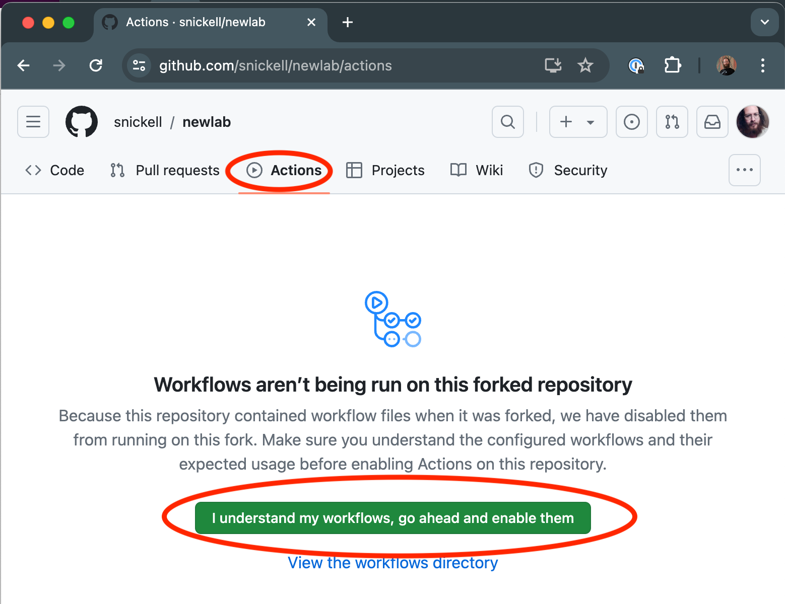
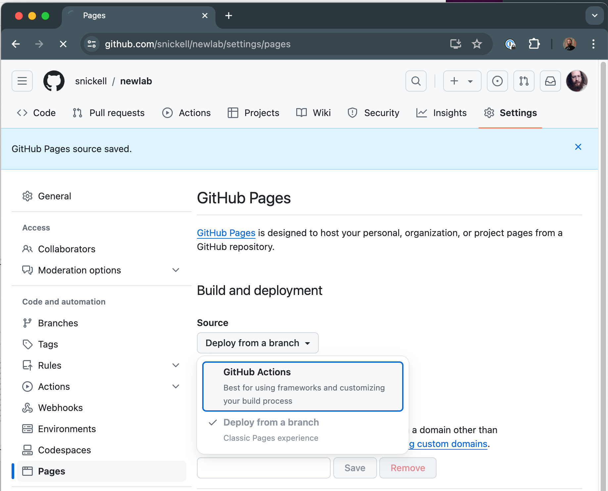

# Protolab

The idea behind protolab is you fork this repo, and it provides a quick starting point for
hacking together ideas for new labs, initially focusing on block-based labs. You can see what an
empty protolab looks like here: https://code-dot-org.github.io/protolab/.

Currently:
- Vite-based for fast builds, rebuilds, and react refresh
- A backend-less URL you can share with testers
- Easy pattern to get started with: see [Lab.tsx](./src/Lab.tsx)
- Relatively simple to add new blocks: see [blocks.ts](./src/blocks.ts)
- Includes GitHub Actions that publish changes to github.io whenever you push
- Includes a GitHub codespace, so you can do quick development without a local clone
- Saves and loads blockly workspaces to localStorage, 
- When testers access your protolab on its github.io address, their sessions are "screen recorded" to highlight.io

Planned:
- Baked-in patterns for lab output based on: react, canvas, p5 and babylon.js
- Local download/restore of blockly saves as a .json file, so they can be shared

## Dev

1. yarn install (not required in codespace)
1. yarn dev
1. Open: http://localhost:9001

## Forking a new Protolab

Lets say you'd like to prototype a new protolab called `newlab`:

1. **Fork Protolab** to your GitHub account
   1. Open: https://github.com/code-dot-org/protolab, click the Fork button
   1. Select yourself as the owner, repository name: `newlab`, click Create Fork
   1. After the fork completes, you'll be taken to your new GitHub repo: https://github.com/username/newlab

1. **Enable GitHub actions**, to automatically build your repo on push
  

1. **Enable GitHub Pages**, by setting Deployment Source to Github Actions
  

1. **Create a codespace** or clone locally
  

1. **Make a source change**
   1. Edit `src/Lab.tsx` and change `LAB_NAME` to `newlab`
   1. Commit the change, and push it back to your repo
   1. GitHub Actions will build on push, you can find active builds at: https://github.com/username/newlab/actions
   1. About 1 minute later, you can **view your changes** on: https://username.github.io/newlab

1. When you're ready to collaborate with others, **Fork Protolab** back to the code-dot-org organization